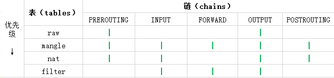

# iptables的5条‘链’ -> 作为关口进行把关 （我把这五条链看作墙）

    PREROUTING  : 路由前
    INPUT       : 收包
    FORWARD     : 转发
    OUTPUT      : 发包
    POSTROUTING : 路由后
(如图)

# iptables的4张‘表’ -> 作为不同功能规则的集合

    filter表    : 负责过滤功能，防火墙；内核模块：iptable_filter
    nat表       : 网络地址转换功能；内核模块：iptable_nat
    mangle表    : 拆解报文，做出修改，并重新封装 的功能；iptable_mangle
    raw表       : 关闭nat表上启用的连接追踪机制；iptable_raw 

（如图）  

# 综合

（如图）

